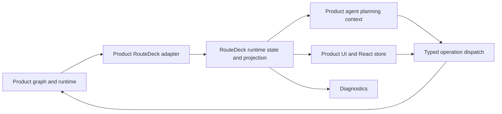
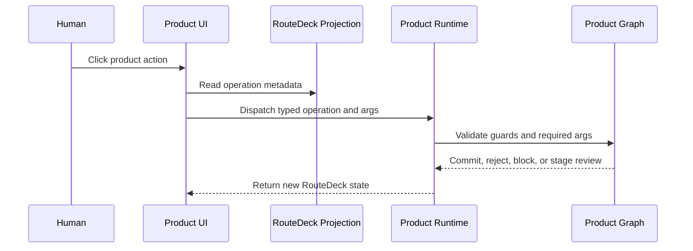
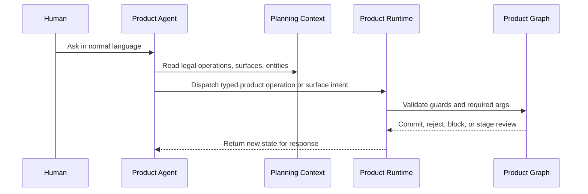

# RouteDeck: Graph-Backed State Runtime For Agentic UI

Status: Whitepaper
Date: 2026-05-26

Canonical terms live in `docs/route-deck-reference.md`. This whitepaper explains
the architecture in narrative form.

RouteDeck is a state runtime for products where humans, agents, and browser
navigation all need to act against the same graph-owned truth.

It exists because agentic product UI has a different state problem from a normal
web app. A user can click a button, ask an agent to do the same thing in normal
language, refresh the browser, replay a URL, or inspect diagnostics. All of
those paths need the same answer to a simple question: what is true right now,
and what is legal to do next?

RouteDeck's answer is not another chatbot and not another workflow database.
RouteDeck projects validated graph state into a shared runtime contract. Product
UI renders that contract. Product agents interpret user intent against that
contract. Product runtimes validate and commit every state change.

The core rule is:

```text
RouteDeck exposes validated app state and legal capabilities.
Product agents interpret normal chat against product-facing context.
The graph/runtime validates, reviews, commits, or rejects every operation.
```

## Executive Summary

RouteDeck is graph-backed state management for agentic UI.

In a RouteDeck-backed product, the graph owns workflow truth. RouteDeck exposes a
projection of that truth: the current node, the current surface, valid surfaces,
legal operations, blocked operations, readiness metadata, diagnostics, and
browser navigation state. Humans and agents both act through typed operations.

That distinction matters. A legal operation is not automatically a button. A
legal operation may be direct, form-backed, selector-backed, surface-opening,
review-required, blocked, or hidden/internal. RouteDeck makes those differences
explicit so product UI does not leak framework mechanics and product agents do
not invent unsafe behavior.

The result is a product shell where:

- clickable controls and chat-driven actions share one validated operation path
- browser URLs and history replay location state without pretending to be user
  intent
- diagnostics can explain graph behavior without polluting public product chat
- product teams can test the boundary between graph truth, UI rendering, and
  agent planning

## The Problem RouteDeck Solves

Most product UI state assumes one primary actor: the human using the screen. The
screen owns local state, calls APIs, and updates itself after responses return.

Agentic products add more actors:

- a human clicks product controls
- a human asks an agent to do the same thing in natural language
- the browser can reload or replay a deep link
- the graph can block an action because a prerequisite is missing
- the runtime can require review before a side effect
- diagnostics need to show why an action is allowed or blocked

If every actor gets its own state model, the product drifts. The UI shows one
set of actions, the agent reasons over another, browser replay bypasses guard
logic, and diagnostics become a private alternate truth.

RouteDeck keeps those paths aligned by making graph state projectable. The graph
remains the authority, while RouteDeck gives every client a common way to ask:

- Where am I?
- What surface is active?
- What can be shown?
- What can be done?
- What is blocked, and why?
- What needs a form, selection, confirmation, or review?
- What can be replayed from the browser location?

## Mental Model

RouteDeck should be understood as a boundary, not a brain.



The product graph owns the truth: persistent state, current workflow, guards,
permissions, tenancy, required arguments, review gates, and commits.

RouteDeck owns the reusable runtime contract: manifest shape, runtime state
shape, operation metadata, readiness metadata, surfaces, projection helpers,
navigation primitives, and diagnostics contracts.

The product agent owns interpretation: turning normal chat into one typed
product operation, one product surface intent, or a clarification. Product
agents, agent execution, and agent streaming endpoints are product-owned. They
are not RouteDeck operations.

The product UI owns presentation: visual design, product language, forms,
selectors, review screens, and product-specific components.

The runtime owns enforcement: every click, chat action, browser replay, and
diagnostic dispatch is validated before it changes graph state.

There are several kinds of truth in this boundary:

- the product graph/runtime owns workflow truth and commit authority
- the product domain owns business data, permissions, policy, and side effects
- RouteDeck owns the reusable projection contract for what is visible, legal,
  blocked, inspectable, and dispatchable
- the product agent owns conversational execution and normal-language
  interpretation

Keeping those truths separate lets RouteDeck stay visible without absorbing the
product.

## Core Primitives

### Manifest

The manifest is the static contract for a RouteDeck-backed product. It describes
the shape of the graph-facing application: possible nodes, edges, operations,
fields, policies, and surface metadata.

The manifest is not live state. It is the set of things the product may be able
to do.

### Runtime State

Runtime state is the current graph-backed state exposed through RouteDeck. It
answers what is true now.

Typical runtime state includes:

- graph state snapshot
- current node and active surface
- active surfaces and surface options
- legal operations
- blocked operations
- navigation state
- diagnostics
- projection version
- runtime status

React may mirror runtime state in a store. React local state must not become the
source of graph truth.

### Projection

Projection is the UI-facing and agent-facing view of runtime state. It is the
shape clients consume.

Projection tells clients:

- which operation ids are legal
- which operations can dispatch now
- which operations need fields, selection, confirmation, review, or recovery
- which surfaces are active or available
- which entities are visible and can be bound to operations
- which diagnostics are available

Projection is output. It does not own graph behavior.

### Operations

Operations are typed actions dispatched by a human, product component, product
agent, or runtime client.

Important operation metadata includes:

- `id`
- `label`
- `description`
- `category`
- `input_schema`
- `invocation_kind`
- `can_dispatch_now`
- `required_args`
- `missing_args`
- `accepted_arg_keys`
- `safety_class`
- `execution_mode`
- `target_node`

The metadata is as important as the operation id. It tells clients whether the
operation can be clicked, whether a form is needed, whether an entity must be
selected, whether review is required, or whether the operation is internal only.

### Surfaces

Surfaces are graph-projected UI regions. They let the runtime declare what can
be shown without letting local UI state become workflow truth.

Common roles:

- `frame`: stable context around the active work
- `active`: current working surface
- `diagnostic`: read-only inspection

Common kinds:

- `peer`: alternate same-node view
- `detail`: nested or review view
- `embedded`: supporting inline view

Surfaces let a product stay flexible without turning every tab or panel into a
new graph node. A same-node peer surface can represent "policy gaps" versus
"failed executions"; a detail surface can represent one execution trace review.

## Two Navigation Lanes

RouteDeck has two navigation lanes. Keeping them separate is the difference
between a usable product agent and a framework leak.

### Internal Navigation Lane

RouteDeck supports generic route operations:

- `route.open_node`
- `route.switch_surface`
- `route.back`
- `route.forward`
- `route.cancel`

These exist for runtime plumbing, browser replay, history, recovery, and
diagnostics. They are useful infrastructure.

They should normally be hidden from normal product UI and normal product-agent
planning. A user should not see "Open node" as a product action. An agent should
not need to say it will call `route.switch_surface`.

### Product Planning Lane

Product agents should see product-facing context:

- current node and surface summary
- active product record summary
- valid product surface options
- visible entities with bound operation arguments
- product legal operations
- labels, descriptions, accepted args, and readiness metadata

The agent's job is to interpret normal chat against that context. It can choose
a typed product operation, choose a valid product surface intent, or ask a
product-safe clarification. The runtime can then map a valid surface intent to
an internal route dispatch.

The model does not need backend phrase tables. It needs complete context and a
validated operation boundary.

## One Path For Clicks And Chat

Clickable actions and chat-driven actions should converge on the same typed
operation path.





The two flows differ in interpretation, not authority. A click already has a
selected control. A chat turn needs the agent to infer intent from conversation
and context. Both must end at runtime validation.

## Operation Visibility

RouteDeck intentionally separates legality from presentation.

| Operation state | UI behavior | Agent behavior |
| --- | --- | --- |
| `can_dispatch_now=true`, `invocation_kind=direct` | Render as a one-click product action when useful | Dispatch when intent matches |
| `invocation_kind=form` | Open a form or review surface | Collect missing fields before dispatch |
| `invocation_kind=entity_selector` | Open a selector or bind selected entity | Bind visible entity args or ask/select |
| `invocation_kind=surface` | Show product surface navigation | Choose surface intent from valid options |
| `invocation_kind=hidden` | Do not render as product action | Do not expose in normal planning |
| `execution_mode=review` | Stage review before side effect | Explain review and wait for approval |
| `execution_mode=blocked` | Show recovery or prerequisite | Ask for allowed prerequisite |

This table is one of RouteDeck's most important design constraints. Without it,
products tend to render every legal operation as a button and expose internal
route operations as if they were product actions.

## Human Experience

Humans should experience RouteDeck through product language:

- workflows
- current work
- review
- details
- back and forward
- cancel
- policy candidates
- execution traces

Humans should not need to see framework language in normal product UI:

- RouteDeck node
- graph edge
- operation id
- trace id
- endpoint path
- internal slot name

Those details can appear in diagnostics when the user is explicitly in a
developer or inspection surface.

## Agent Experience

A product agent using RouteDeck should follow this loop:

```text
Read product-facing RouteDeck planning context.
Interpret user intent against legal operations, visible entities, and surfaces.
Choose one typed product operation, choose one product surface intent, or clarify.
Dispatch through the product runtime.
Read the returned state.
Respond using product-safe language.
```

The agent should not infer hidden permission from conversation. It should not
patch graph state directly. It should not call product side-effect APIs directly
when a graph operation exists. It should not expose operation ids, endpoint
paths, trace ids, approval ids, or auth details in public chat.

RouteDeck gives the agent enough state to act normally without a backend phrase
router. If the user says "open Live Commerce" and the current context exposes a
visible entity with a bound `saas_agent.open` operation, the agent can choose
that operation because the context makes it legal and specific.

Agent authority should be explicit:

| User intent | Agent behavior | Runtime boundary |
| --- | --- | --- |
| Greeting, explanation, or low-risk read | Respond directly in product language | No dispatch needed |
| Missing required inputs | Ask focused product-language questions | Do not guess hidden args |
| Legal direct product action | Dispatch the typed operation | Runtime validates guards and args |
| Review-required or destructive action | Propose and wait for confirmation | Commit only after the review boundary |
| Blocked, unauthorized, or hidden behavior | Explain, recover, or defer | Do not bypass RouteDeck projection |

This authority model keeps chat useful without turning the agent into a parallel
backend.

## Developer Experience

A product integration usually has this shape:

```text
Product graph
  -> product RouteDeck adapter
    -> RouteDeck runtime state
      -> product API plane and optional RouteDeck API plane
        -> product shell, product agent, RouteDeck React store, diagnostics
```

The product adapter is where domain state becomes RouteDeck state. It should
translate product graph facts into nodes, surfaces, legal operations, blocked
operations, and diagnostics. It should not move domain behavior into RouteDeck
framework source.

A reusable backend runtime normally exposes:

```python
class ProductRouteDeckRuntime:
    async def snapshot(self, context) -> RouteDeckRuntimeState: ...
    async def projection(self, context) -> RouteDeckProjection: ...
    async def dispatch(self, request, context) -> RouteDeckDispatchResult: ...
    async def inspect(self, query, context) -> RouteDeckIntrospection: ...
    async def stream(self, context) -> AsyncIterator[RouteDeckEvent]: ...
```

Two API planes are valid, and they should stay distinct.

The product API plane exposes domain behavior in product language:

```text
GET  /api/<product>/state
POST /api/<product>/action
POST /api/<product>/agent/stream
POST /api/<product>/inspect
```

The RouteDeck API plane exposes framework concepts in generic RouteDeck
language:

```text
GET  /api/routedeck/manifest
GET  /api/routedeck/snapshot
GET  /api/routedeck/projection
POST /api/routedeck/dispatch
POST /api/routedeck/inspect
GET  /api/routedeck/stream
```

Public `/api/routedeck/*` routes are valid and encouraged when they expose
generic RouteDeck manifest, snapshot, projection, dispatch, inspect, and stream
contracts. The wrong boundary is placing product-specific auth, tenancy,
checkout, workspace, agent execution, or domain graph behavior under the
RouteDeck namespace.

## Browser Replay Is Not Product Intent

Browser URLs are location replay. They are not product intent.

If a user loads a deep link, presses Back, presses Forward, or refreshes the
page, the runtime should validate the requested location against current graph
state. Unknown node/surface combinations, injected review surfaces, and invalid
record combinations should be rejected or recovered according to runtime policy.

That validation may internally dispatch route operations. It should not expose
those route operations as normal product actions.

## Diagnostics Without Product Leakage

Diagnostics are necessary. They make graph behavior inspectable and testable.

Diagnostics should be allowed to show:

- current graph node and surface
- legal operations
- blocked operations and reasons
- route trace
- active surfaces
- selected-node details
- runtime snapshot and projection version
- reachability and guard explanations

Public product chat is different. It must not expose:

- operation ids
- endpoint paths
- trace ids
- approval ids
- cart ids
- raw API auth headers
- internal slot names
- raw graph state
- hidden route operation names

Diagnostics can be technical. Public product chat must be product-safe.

## SaaStoAgent Case Study

SaaStoAgent uses RouteDeck to coordinate its owner workbench, Corpus product
agent, graph runtime, browser navigation, and diagnostics.

In the current integration:

- the product graph/runtime owns SaaS Agent workflow truth
- RouteDeck exposes runtime state, projection, legal operations, surfaces, and
  diagnostics
- Corpus interprets normal owner chat against product-facing planning context
- React renders product surfaces and dispatches typed operations
- backend runtime validates node/surface combinations, required args, and review
  gates

The important boundary is that RouteDeck does not decide product intent. Corpus
does not bypass graph validation. React does not become graph truth.

SaaStoAgent also illustrates the two navigation lanes:

- internal route operations remain available for browser replay, history, and
  diagnostics
- normal Corpus planning sees product operations, product surface options, and
  visible entities

This is why "Open node" and "Switch surface" should not be normal product action
chips. They are framework infrastructure. The product-level actions are things
like opening a SaaS Agent, listing agents, saving instructions, reviewing a
policy candidate, or opening a valid product surface.

## Anti-Patterns

Avoid these patterns:

- rendering every `legal_operation` as a generic quick action
- exposing `route.open_node` or `route.switch_surface` as ordinary product UI
- adding backend phrase tables or alias routers for normal chat
- letting React local state own graph truth
- letting a product agent patch graph state directly
- calling product side-effect APIs directly when a graph operation exists
- treating browser URL replay as normal product intent
- placing product ids, SaaS provider behavior, or auth semantics in RouteDeck
  framework source
- making diagnostics language visible in public deployed chat
- drawing action ids as graph topology

## Testing The Boundary

RouteDeck-backed products should test the contract, not just the components.

Important tests include:

- planning context excludes hidden/internal route operations
- blocked operations are absent from normal product planning context
- product legal operations remain available when guards allow them
- valid product surface options map to validated internal route dispatch
- direct URL load preserves valid node and surface state
- invalid surface injection is rejected or recovered
- browser back/forward works without exposing route operations to product chat
- clickable actions dispatch typed operations through the same runtime path as
  chat-driven actions
- diagnostics expose internals only in diagnostic surfaces
- public chat does not leak operation ids, endpoint paths, trace ids, approval
  ids, auth headers, or hidden route names

These tests are not incidental. They encode the architecture.

## Open Framework Direction

RouteDeck can become an open framework when its reusable pieces are separated
from product-specific adapters:

- product-neutral manifest and runtime schemas
- product-neutral projection helpers
- product-neutral React store and hooks
- optional adapters for graph runtimes such as LangGraph
- reusable diagnostics components
- minimal examples that do not depend on SaaStoAgent data or services
- a future Medusa agent reference app that demonstrates product-specific
  adoption without moving Medusa behavior into RouteDeck packages
- clear boundary docs that explain what RouteDeck does not own
- public-readiness gates for license metadata, third-party notices, package
  metadata, and public-surface scrub before publication

SaaStoAgent should remain a case study and integration, not the framework
itself. Medusa is the future product-specific reference example. Superseded
plans such as PropertyDesk should not be described as the active reference-app
plan.

## Glossary

The canonical framework reference is `docs/route-deck-reference.md`. This
glossary is a compact reading aid for the whitepaper.

RouteDeck: The graph-backed runtime and projection contract for agentic UI.

Product graph: The product-owned workflow authority that validates and commits
state transitions.

Manifest: The static declaration of possible nodes, operations, fields, policies,
and surfaces.

Runtime state: The current graph-backed state exposed through RouteDeck.

Projection: The client-facing view of runtime state used by UI, agents, and
diagnostics.

Operation: A typed action that can be dispatched through the runtime.

Surface: A graph-projected UI region or view option.

Hidden operation: A runtime or diagnostic operation that should not appear in
normal product UI or normal product-agent planning.

Product action: A user-facing or agent-facing operation expressed in product
language.

Browser replay: Validation and restoration of location state from URLs/history,
not normal product intent.
