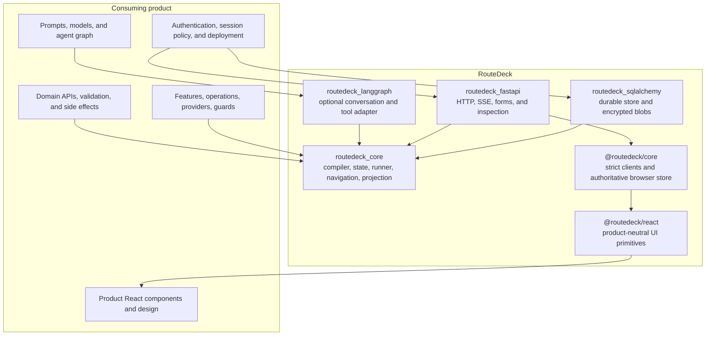

# Architecture

RouteDeck is a product-neutral kernel with optional persistence, transport,
agent, and frontend adapters. A consuming application supplies the domain
parts through typed boundaries.

## Package map



## Core runtime

`compile_app(...)` validates product declarations. `bind_app(...)` requires an
exact async implementation for every declared handler, provider, and guard.
The framework then builds one immutable `RouteDeckRuntime` containing:

- one bound application;
- one session store and sensitive codec;
- one `RouteDeckOperationRunner`;
- navigation over that exact runner;
- one configured projector;
- an optional product-supplied agent driver;
- one explicit lifecycle.

There is no second runner, hidden in-memory store, fallback model, or alternate
cleanup path.

## Dependency direction

```text
product declarations and implementations
        |
        v
routedeck_core <- persistence / FastAPI / LangGraph adapters
        |
        v
generated public contract -> @routedeck/core -> @routedeck/react -> product UI
```

- Core never imports Medusa or another product.
- Adapters depend on core contracts.
- The product selects adapters and supplies policy; it does not rebuild their
  internals.
- Python contracts generate strict browser contracts. The browser does not
  invent operations or infer state from presentation.

## State authorities

| Concern | Authority |
| --- | --- |
| Product records and side effects | Product API/database |
| Durable interaction state | RouteDeck session |
| Legal operations and navigation | Compiled RouteDeck application/navgraph |
| Model/tool orchestration | Product-owned agent graph |
| Public browser state | RouteDeck projection mirrored by `@routedeck/core` |
| Visual presentation | Product React components |
| User/session authorization | Product host and session selector |

Keeping these authorities distinct is the design. A LangGraph checkpoint, a
React reducer, an API response, or an LLM sentence cannot directly become a
RouteDeck state change.

## Adapter boundary

The product composition root may choose configuration and call public RouteDeck
factories. RouteDeck owns generic assembly and lifecycle. This keeps the
reference consumer focused on business behavior and lets future consumers use
the same reliability semantics.

See the canonical
[framework reference](https://github.com/saastoagent/routedeck/blob/main/docs/route-deck-reference.md)
and accepted
[ADR-006](https://github.com/saastoagent/routedeck/blob/main/decisions/ADR-006-framework-owned-runtime-and-conversation-boundary.md)
for the controlling contract.
