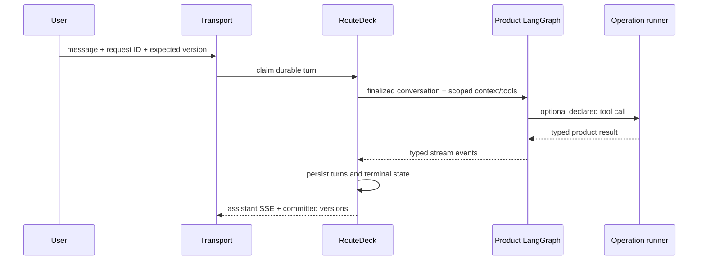

# Conversation and LangGraph

The LangGraph adapter is optional. RouteDeck can govern application state
without an agent, and it does not compile or own a product's model graph.

## Two authorities

| RouteDeck navgraph | Product LangGraph |
| --- | --- |
| Durable product location | Model/tool orchestration |
| Legal semantic operations | Prompt and reasoning topology |
| Review, recovery, and navigation | Model and tool-selection policy |
| Public projection and surfaces | Product wording and graph state |
| Canonical interaction session | Product-selected model runtime |

The product keeps `create_agent(...)` or a raw `StateGraph`. RouteDeck provides
a driver, middleware, and tool wrapper around that product-owned graph.

## Model context and tools

Before a model call, `RouteDeckMiddleware`:

1. loads the selected current session;
2. reconstructs durable finalized messages;
3. injects default-deny JSON context;
4. exposes only currently legal RouteDeck operations as tools.

`RouteDeckToolWrapper` validates invocation context and sends the tool call
through the same operation runner used by UI affordances. A tool observation
becomes durable conversation only through the parent-turn lifecycle.

## User-authored turn

## Assistant-initiated turn

The product may explicitly trigger an assistant-only graph for a greeting or
other product-selected behavior. RouteDeck sends no synthetic user message,
requires exactly one streamed non-tool assistant result, and rejects tool calls
or review output on this path. It uses the same lease, replay, interruption,
cleanup, and persistence model as a user turn.

## Conversation failure

Graph or stream failure persists an interrupted marker before emitting the
public error and terminal frame. If interruption persistence itself cannot be
proven, the terminal state is outcome-unknown. Cancellation shields the
interruption write and closes the graph event stream.

Returning `None` from the product graph factory explicitly makes conversation
unavailable. RouteDeck does not select a fallback model, canned answer, or
alternate provider.

## What RouteDeck does not do

- It does not translate the navgraph into a `StateGraph`.
- It does not author prompts or choose models.
- It does not execute domain tools outside the supervised handler boundary.
- It does not treat model prose as an application state change.
- It does not use a LangGraph checkpoint as the canonical RouteDeck session.

See the repo-local
[LangGraph integration skill](https://github.com/saastoagent/routedeck/blob/main/skills/routedeck-langgraph-integration/SKILL.md)
for the focused wiring procedure.
