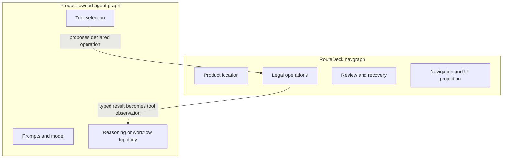

# Core Concepts

RouteDeck is easiest to understand as a boundary around application-semantic
state changes. The UI and the agent may propose actions, but neither becomes a
second source of application truth.

## The ownership boundary

| RouteDeck owns | The consuming product owns |
| --- | --- |
| Compiled application and navgraph | Feature declarations and business meaning |
| Canonical session and projection | Users, tenants, authentication, and authorization |
| One supervised operation path | Product handlers, APIs, validation, and side effects |
| Review, request replay, leases, and recovery state | Product recovery and reconciliation decisions |
| Routes, exact history, opaque handles, and public events | Domain IDs, route-key resolution, and product facts |
| Generic FastAPI/SSE and browser synchronization | Deployment, CORS, cookies, and host policy |
| Optional LangGraph driving and supervised tool wrapper | Prompts, models, graph topology, policy, and wording |
| Product-neutral React primitives | Product components, copy, layout, and styling |

RouteDeck coordinates product behavior. It does not execute product behavior
on its own.

## Authoring concepts

### Application

The small composition root that names an app, selects independently owned
features, and chooses one entry node.

### Feature

A product-owned module with a unique namespace and complete nodes. Feature
composition is selection, not model patching or a second transition table.

### Node

A durable product-facing location such as a section, detail page, workflow
step, or result. A RouteDeck node is not a LangGraph node.

### Navgraph

The compiled set of nodes and exact operation/outcome transitions. It answers:
where is the user, what is legal here, and where can each declared outcome go?

### Route and route entry

A route maps a canonical path to a node. A `RouteEntry` binds path parameters
to a declared supervised operation so the product can resolve a public route
key from real data.

## Behavior concepts

### Operation

A declared application-semantic read or write. It defines input, allowed
invocation sources, outcomes, safety, providers, guards, review, recovery, and
public metadata. The product chooses its supported sources; RouteDeck compiles,
projects, and enforces them before the product handler runs.

### Provider

Loads current operation-scoped facts or entity allowlists from a trusted
product source.

### Guard

Uses the typed provider results to allow, block, or require another declared
posture. A guard never silently substitutes missing data.

### Outcome and transition

A handler returns a declared outcome. At a node, that operation/outcome pair
has exactly one declared target. RouteDeck validates this before runtime.

### Review and needs-input

Durable dispositions that pause execution. Review records a proposal tied to
the current context and version; acceptance rechecks the context before the
write executes. Needs-input asks for missing declared input rather than
guessing it.

## State and presentation concepts

### Session

One immutable, versioned, durable interaction context. It contains current
location and history, finalized conversation, operation/review state, private
bindings and drafts, public surfaces, status, and failures.

### Projection

The default-deny public view of the session. Only explicitly declared public
state enters the browser, model context, events, or inspection output.

### Surface

A framework-declared product UI slot with a component name, public props
schema, lifecycle, and operation-backed affordances. The React component and
visual design remain product-owned.

### Opaque handle

A public token that refers to a private product entity ID. Resolution works
only for the current session, node, operation, entity kind, allowlist, and
version.

### Private form

A separate encrypted, no-store channel for declared private fields. Private
values never enter the public surface props, event log, inspector, or model
context.

## Reliability concepts

### Request ID and fingerprint

Every mutation has caller-owned identity. Repeating an ID with the same input
replays the recorded result; using it with different input is a conflict. This
prevents accidental duplicate work without treating every retry as safe.

### Delivery evidence

External writes record `not_sent`, `possibly_sent`, or `response_received`.
When the outcome is uncertain, RouteDeck exposes explicit recovery state and
does not silently retry.

### Event cursor and resync

Public events are persisted before fanout and have ordered cursors. If a client
misses retained history or sees a version gap, it reloads authoritative state
instead of inventing continuity.

## The two graphs

The graphs interact, but they do not replace each other.

Continue with [Architecture](./Architecture.md) or use the
[Glossary](./Glossary.md) as a lookup table.
