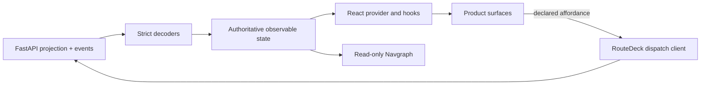

# HTTP, Browser, and React

RouteDeck provides a generic transport and authoritative browser runtime while
leaving deployment policy and product presentation to the consumer.

## FastAPI plane

The host mounts one router from one runtime with an explicit session selector.
The `/api/routedeck` plane contains:

| Endpoint | Purpose |
| --- | --- |
| `GET /contract` | Compiled frontend contract |
| `POST /sessions` | Create and initialize a selected guest session |
| `GET /session` | Current public projection |
| `GET /conversation` | Finalized public conversation |
| `POST /chat` | Durable user-authored turn |
| `POST /conversation/assistant-turn` | Durable assistant-only turn |
| `POST /navigation` | Exact versioned navigation |
| `POST /dispatch` | Versioned surface operation |
| `POST /reviews/{id}/accept` | Accept a current proposal |
| `POST /reviews/{id}/reject` | Reject a current proposal |
| `GET /events` | Replayable typed public SSE |
| `GET|PUT /private-forms/{id}` | No-store private-form channel |
| `GET /inspect` | Public topology and diagnostics |

The host owns CORS, authentication, cookie security, origin policy, product
health, and deployment. Missing runtime, driver, or selector returns a visible
unavailable result; transport does not construct a hidden substitute.

## `@routedeck/core`

The headless TypeScript package provides:

- strict generated contract decoders;
- credential-aware HTTP and SSE clients;
- user and assistant conversation clients;
- bootstrap, exact request retention, event replay, and resync;
- route codec and browser-history adapter;
- isolated private-form state;
- the authoritative observable browser mirror of server projection.

The store rejects regressing or gapped versions. It never turns an optimistic
browser mutation into confirmed state.

## `@routedeck/react`

The React package provides product-neutral primitives:

- `RouteDeckProvider` and hooks/selectors;
- surface host and product component registry;
- operation, private-form, review, navigation, status, and error primitives;
- conversation lifecycle and named presentation actions;
- lazy, read-only Navgraph inspection.

Product code owns components, props interpretation, wording, layout, theme, and
styling.

## Browser convergence

When a mutation receives a known `4xx`, it is a confirmed rejection. A lost
response, malformed success envelope, or relevant `5xx` may be outcome-unknown
because the server could already have committed. The client retains the exact
request ID and payload and blocks conflicting reuse until explicit retry or
abandonment/resync.

SSE transport may reconnect. A missing or expired session is terminal and
stops the stream instead of polling forever.
