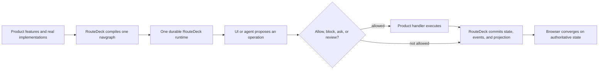

# RouteDeck Wiki

RouteDeck is state management and interaction governance for agentic
applications. It keeps application state, legal operations, navigation,
review, private data boundaries, events, and browser synchronization coherent
while the product keeps ownership of its APIs, business logic, prompts,
models, agent graph, authentication, and visual design.

> RouteDeck is currently alpha source software. The repository is public, but
> PyPI and npm registry packages are not yet claimed as published. The
> tutorials therefore install from the source checkout.

## The 30-second model

The RouteDeck **navgraph** is the durable map of product locations and legal
operations. It is not the product agent's LangGraph or other model/tool
orchestration graph.

## Choose a path

| You want to... | Start here |
| --- | --- |
| See RouteDeck work in five minutes | [Hello World](./Hello-World.md) |
| Understand the vocabulary | [Core Concepts](./Core-Concepts.md) |
| Understand the whole request lifecycle | [How RouteDeck Works](./How-RouteDeck-Works.md) |
| Design features and navigation | [Applications and the Navgraph](./Applications-and-the-Navgraph.md) |
| Add safe reads, writes, and review | [Operations and Supervision](./Operations-and-Supervision.md) |
| Add an agent without surrendering state authority | [Conversation and LangGraph](./Conversation-and-LangGraph.md) |
| Add FastAPI, TypeScript, or React | [HTTP, Browser, and React](./HTTP-Browser-and-React.md) |
| Study a complete consumer | [Medusa Reference Application](./Medusa-Reference-Application.md) |
| Debug a failure | [Failure Semantics](./Failure-Semantics.md) and [Testing and Diagnostics](./Testing-and-Diagnostics.md) |

## Wiki map

1. [Hello World](./Hello-World.md) — install from source and compile one app.
2. [Core Concepts](./Core-Concepts.md) — the vocabulary and ownership model.
3. [Architecture](./Architecture.md) — package and product boundaries.
4. [How RouteDeck Works](./How-RouteDeck-Works.md) — end-to-end flow.
5. [Applications and the Navgraph](./Applications-and-the-Navgraph.md) —
   feature-first authoring and compilation.
6. [Operations and Supervision](./Operations-and-Supervision.md) — providers,
   guards, review, handlers, effects, and uncertain writes.
7. [Sessions, Persistence, and Events](./Sessions-Persistence-and-Events.md) —
   canonical state, request identity, journals, leases, replay, and SSE.
8. [Projection, Surfaces, and Privacy](./Projection-Surfaces-and-Privacy.md) —
   default-deny public state, opaque handles, UI surfaces, and private forms.
9. [Navigation and History](./Navigation-and-History.md) — routes, deep links,
   exact browser history, and session selection.
10. [Conversation and LangGraph](./Conversation-and-LangGraph.md) — the optional
    agent adapter and the two-graph boundary.
11. [HTTP, Browser, and React](./HTTP-Browser-and-React.md) — transport and
    frontend integration.
12. [Failure Semantics](./Failure-Semantics.md) — fail-closed behavior and
    recovery rules.
13. [Testing and Diagnostics](./Testing-and-Diagnostics.md) — focused proof and
    read-only Navgraph inspection.
14. [Medusa Reference Application](./Medusa-Reference-Application.md) — the
    complete real-data example.
15. [Glossary](./Glossary.md) and [FAQ](./FAQ.md).

## Documentation authority

This wiki is the learning layer. It explains the current contracts but does
not redefine them. When details disagree, use the repository's
[critical prompt](https://github.com/saastoagent/routedeck/blob/main/critical_prompt.md),
[accepted ADRs](https://github.com/saastoagent/routedeck/tree/main/decisions),
[canonical reference](https://github.com/saastoagent/routedeck/blob/main/docs/route-deck-reference.md),
and current source in that order.
