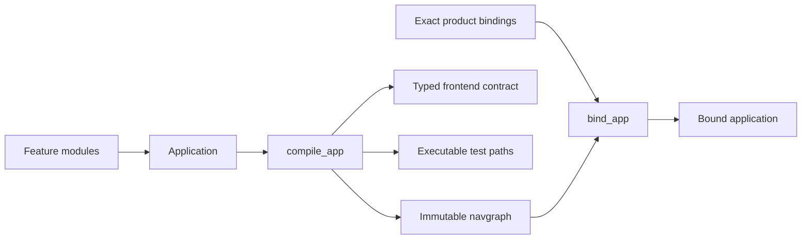
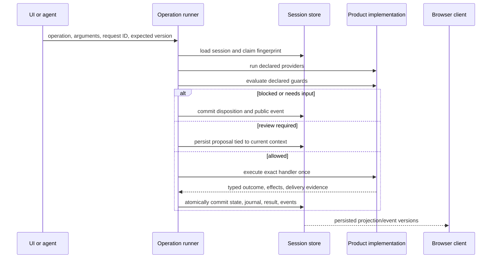

# How RouteDeck Works

This page follows one semantic operation from authoring to a synchronized
browser.

## 1. The product declares meaning

A feature declares nodes, operations, providers, guards, surfaces, routes, and
outgoing transitions. A small `Application` selects features and one entry
node. Product code supplies exact implementations through `FeatureBindings`.

## 2. RouteDeck compiles the contract

Compilation flattens the selected features, derives incoming adjacency, builds
the route and frontend contracts, and rejects invalid topology, identifiers,
schemas, bindings, outcomes, and recovery declarations.

## 3. RouteDeck opens one runtime

The SQLAlchemy runtime opener uses an explicit database URL and encryption key,
opens the durable resources, and delegates to the core builder. The core
builder creates the one operation runner, navigation runner, projector, and
optional agent driver.

## 4. The host selects an authorized session

Every request reaches a product-selected `RouteDeckSessionSelector`. The
selector authenticates and authorizes as needed, then returns one internal
session ID. RouteDeck owns that selected session's state, not user identity or
session-list policy.

## 5. A UI or agent proposes an operation

Both paths use the same operation runner.

## 6. RouteDeck projects only public state

The projector includes the current location, legal operations, opaque handles,
declared surfaces and props, status, safe failures, and limited diagnostics.
Private IDs, form values, credentials, and raw errors stay server-side.

## 7. Events synchronize the browser

Events are committed before live fanout. The TypeScript client strictly
decodes them and rejects gaps or regressions. When it cannot converge, it
reloads the current session projection. Product React components render that
authoritative state.

## 8. Failure stays explicit

- A stale expected version is a conflict.
- A repeated request ID with identical input replays the recorded result.
- A repeated ID with different input fails.
- A known `4xx` is a confirmed rejection.
- A lost or malformed success response can be outcome-unknown.
- A possibly sent external write is not automatically repeated.

That is the core loop: declare, compile, supervise, commit, project, and
synchronize.
