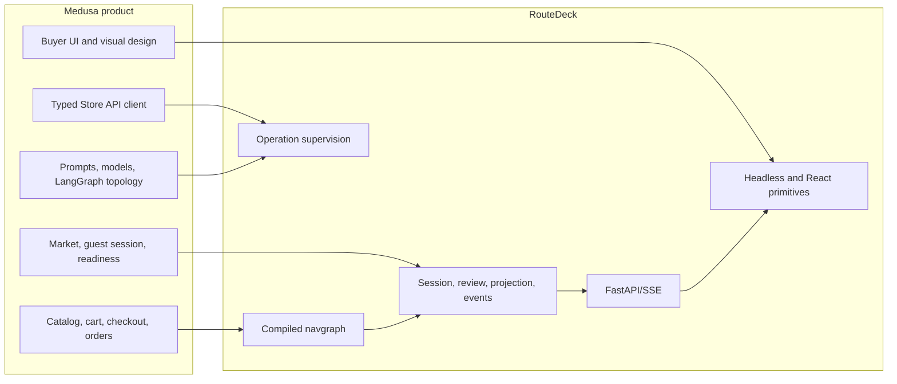

# Medusa Reference Application

The standalone Medusa guest-buyer app is RouteDeck's complete reference
consumer. It uses real local Medusa Store API behavior and keeps all commerce
logic outside the framework.

## Ownership split



Medusa owns catalog resolution, cart mutation, checkout data, shipping,
payment initialization, order placement, independent reconciliation, prompts,
models, product wording, and UI components.

RouteDeck owns opaque handles, private forms, review, one supervised execution
path, durable request/result journals, navigation, exact history, projection,
events, generic conversation driving, and browser convergence.

The browser never calls Medusa `/store/*` directly.

## What the flow covers

- browse and product detail;
- exact variant selection;
- cart add/update/remove and totals;
- encrypted contact and address forms;
- shipping option discovery and selection;
- system/manual demo payment initialization;
- reviewed order placement;
- uncertain-write reconciliation;
- order confirmation and continue shopping;
- reload, shareable/session-bound links, and exact history.

## Run locally

The reference stack is heavier than Hello World. It requires Docker and a real
`OPENAI_API_KEY` for full application readiness; no fallback model or canned
assistant response is provided.

From the repository root on Windows:

```powershell
powershell -NoProfile -ExecutionPolicy Bypass -File .\examples\medusa-agent\scripts\demo-stack.ps1 -Action Provision
powershell -NoProfile -ExecutionPolicy Bypass -File .\examples\medusa-agent\scripts\demo-stack.ps1 -Action Up -Services all
```

Smoke URLs:

- buyer frontend: `http://127.0.0.1:5198`
- agent API: `http://127.0.0.1:8098`
- Medusa server: `http://127.0.0.1:9100`

Stop the stack without deleting protected volumes:

```powershell
powershell -NoProfile -ExecutionPolicy Bypass -File .\examples\medusa-agent\scripts\demo-stack.ps1 -Action Down
```

`Reset` is destructive and is not a normal startup command.

See the complete
[reference-app guide](https://github.com/saastoagent/routedeck/blob/main/examples/medusa-agent/README.md)
and
[contract explanation](https://github.com/saastoagent/routedeck/blob/main/docs/medusa-agent-reference-app.md).
