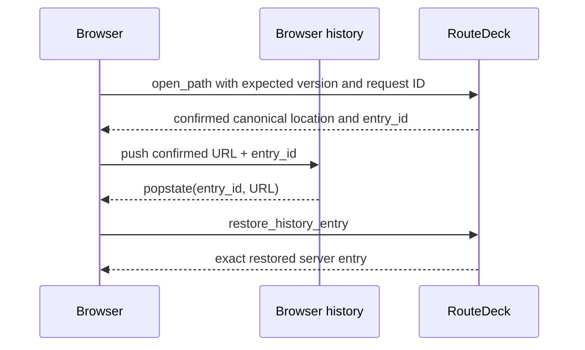

# Navigation and History

RouteDeck treats navigation as a versioned server transaction, not as a URL
guess made by the browser.

## Routes

Routes use normalized segment templates. Decoded parameter values must be
valid UTF-8, cannot contain path separators, and must match the exact declared
parameter set.

Two deep-link policies are implemented:

- `shareable` — may open without an existing guest session; dynamic keys are
  validated by the product or resolved through a declared route-entry
  operation;
- `session_bound` — requires the selected session and an unexpired opaque
  resume handle matching that session, node, and exact parameters.

Resume handles are secret-bearing navigation credentials. They are not
inferred from route names or exposed as internal session IDs.

## Navigation intents

The generic navigation endpoint accepts one declared intent:

- `open_path`
- `back`
- `forward`
- `cancel`
- `restore_history_entry`

The server checks expected version, canonical path, deep-link policy, route
entry, public key, and exact history identity before committing.

## Exact history

Each canonical location has a positive unique `entry_id`. Browser history
stores that identity plus the canonical URL.

On `popstate`, RouteDeck restores the exact server entry and verifies the path.
It does not guess whether the user moved backward or forward and does not
replay product operations.

## Browser bootstrap

For `resume_or_create_shareable`:

1. capture the address-bar path before loading state;
2. try the current selected guest session;
3. if it is missing, expired, or contract-mismatched, create one session only
   when the captured route is shareable;
4. reconcile the captured path through supervised navigation;
5. replace browser history only with the confirmed canonical projection;
6. start event synchronization and load durable conversation.

A session-bound route never creates replacement state. An outcome-unknown
session creation or navigation retains the exact request for explicit retry or
abandonment.

## Diagnostics are not navigation

The Navgraph inspector displays the full compiled transition map and highlights
current/reachable nodes. Selecting an inspector node only shows diagnostics; it
does not navigate, change the URL, invoke a route entry, or mutate the session.
