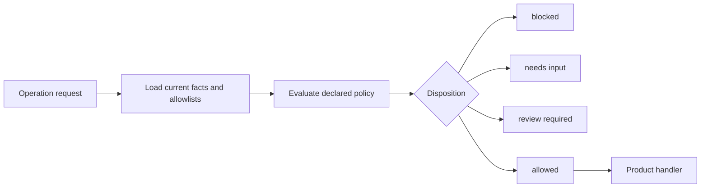
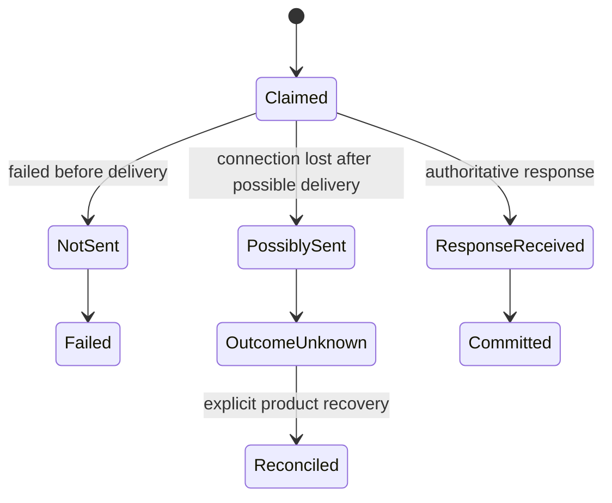

# Operations and Supervision

Every application-semantic read or write crosses one
`RouteDeckOperationRunner`, whether it came from a React affordance, an agent
tool, route entry, system behavior, or recovery action.

## Operation declaration

An operation declares:

- stable ID, title, description, and default-deny input schema;
- a required non-empty set of allowed invocation sources: `agent`, `surface`,
  `route`, and/or `system`;
- safety class and typed outcomes;
- provider and guard references;
- entity inputs and public metadata;
- review policy;
- external-write delivery and recovery metadata.

The declaration is framework-visible. The async handler is product code.
Node legality does not imply that every caller may invoke an operation.
RouteDeck keeps a surface-only operation in public projection, omits it from
agent tools, and blocks any disallowed source before product execution.

## Providers and guards

Providers load only facts declared for the current operation. Guards decide
from those typed facts. A missing provider, malformed result, or failed guard
is not replaced with stale, empty, or heuristic data.

## Execution lifecycle

The runner:

1. loads and validates the current session contract;
2. claims the request ID and fingerprint at the expected version;
3. validates that the request source is declared by the Operation;
4. runs declared providers and builds current entity allowlists;
5. evaluates declared guards;
6. blocks, requests input, stages review, or claims execution;
7. invokes the exact product handler once when allowed;
8. records delivery evidence and a typed result;
9. validates effects and the declared operation/outcome transition;
10. commits state, result, journal, and events atomically;
11. notifies subscribers only after persistence.

## Review

A required review becomes a durable proposal tied to:

- the operation specification version;
- current authoritative context fingerprint;
- current projection version;
- an expiry.

Accept and reject are separate versioned mutations. Acceptance reloads and
rechecks current context before executing the original write. A stale or
expired proposal does not run.

## Idempotency and collision

Request IDs are immutable replay identities:

| Situation | Result |
| --- | --- |
| New ID and current version | Evaluate and run normally |
| Same ID and same fingerprint | Replay recorded public-safe result |
| Same ID and different fingerprint | `request_id_reused` conflict |
| Stale expected version | Version conflict before product execution |
| Another owner holds the lease | Typed concurrency conflict |

## External writes

RouteDeck records delivery evidence:

- `not_sent` — the dependency did not receive the write;
- `possibly_sent` — delivery may have happened, but no authoritative response
  is available;
- `response_received` — an authoritative response was received.

`possibly_sent` becomes `external_outcome_unknown` and exposes the product's
declared reconciliation operation. RouteDeck never silently retries the write,
reports success, or changes provider.

The product owns the real side effect and independent reconciliation. RouteDeck
owns the durable evidence and prevents unsafe hidden replay.
