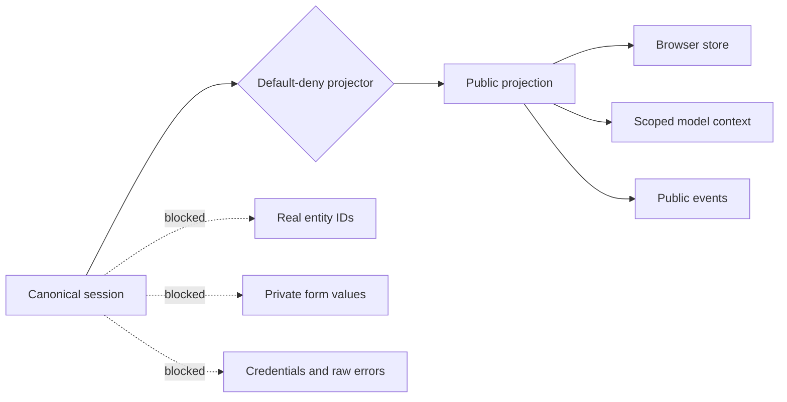

# Projection, Surfaces, and Privacy

RouteDeck separates canonical server state from the deliberately smaller state
that a browser or model may see.

## Default-deny projection

The public projection can include only declared data:

- current location and route parameters;
- navigation identity and availability;
- currently legal operations;
- opaque public entity handles and allowed values;
- projected surfaces and validated public props;
- status, safe failure, and limited diagnostics.

Everything else stays private unless a contract explicitly makes it public.

## Opaque handles

Real product IDs remain in server-side bindings. A public handle resolves only
when all of these still match:

- selected session;
- current node and version;
- current operation;
- declared entity kind;
- provider-built allowlist.

Fabricated, stale, hidden, or cross-context handles fail before the product
handler executes.

## Surfaces

A `Surface` declares:

- stable framework ID;
- product-owned component name;
- `stable` or `ephemeral` lifecycle;
- strict public props JSON schema;
- operation-backed affordances;
- optional server-only private-form authorization.

`SurfaceSlots` places surfaces in `active`, `frame`, `peer`, `detail`, `form`,
`review`, `status`, `error`, or `diagnostic` positions. Product React code
registers the component name and owns its design.

### Stable versus ephemeral

- A stable surface retains canonical public state across navigation so exact
  history can restore it.
- An ephemeral surface exists only while the current node declares it. React
  also keys it by projection version so component-local state resets when the
  projection changes.

## Affordances

A state-changing surface affordance names one declared operation. The surface
host resolves it from the compiled frontend contract and sends it through the
same runner used by an agent tool. A click does not directly patch canonical
state.

## Private forms

A private-form surface declares a server-only `PrivateFormBinding` with:

- the public prop containing its opaque form handle;
- the exact allowed top-level private field names.

The binding is omitted from the frontend contract. The generic transport
authorizes the handle against the currently declared and projected surface
before any read or save.

An untouched authorized form returns revision `0`, `complete: false`, and an
empty value object. A real save atomically advances the revision, records only
public revision metadata in the session/event, and stores encrypted private
values separately. Responses use `Cache-Control: no-store`.

Unexpected fields, forged handles, stale versions, or a draft/blob mismatch
fail loudly. Private values never enter chat, public props, public events,
inspection, or model context.
