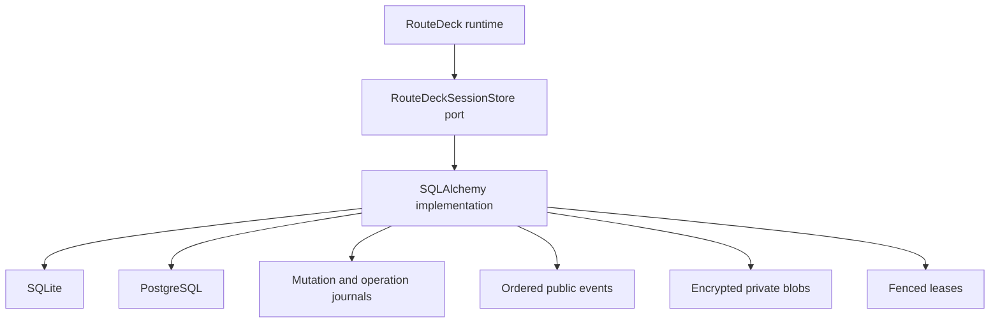
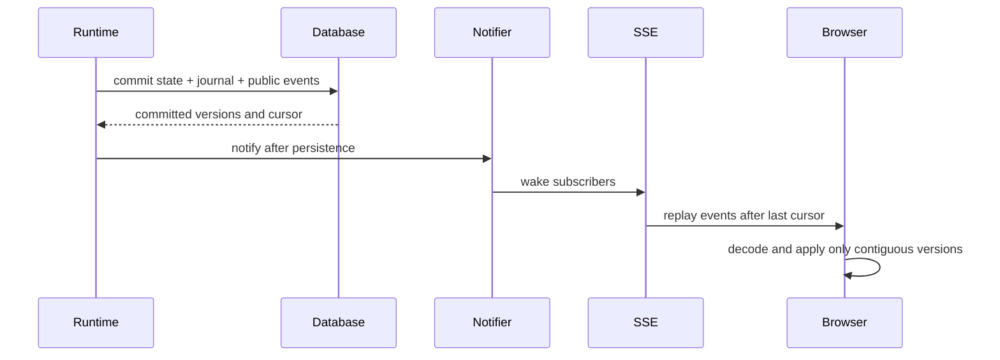

# Sessions, Persistence, and Events

A RouteDeck session is one durable interaction context. RouteDeck owns its
state; the product owns who may select it.

## Canonical session state

`RouteDeckSession` is immutable and versioned. It includes:

- schema and navgraph versions;
- session, projection, and event versions;
- current location plus exact back and forward stacks;
- finalized or interrupted conversation turns;
- active operation and pending review state;
- private drafts, entity bindings, resume capabilities, and configuration;
- public opaque entities, surfaces, status, safe failures, and disabled
  operations;
- durable attempts and typed results.

Named aggregate actions apply explicit events and preserve invariants. A React
state object, model checkpoint, or product API response is not a second
session authority.

## Persistence architecture

The SQLAlchemy adapter provides explicit SQLite/PostgreSQL resources,
transactional journals, events, leases, encrypted blobs, retention, and
restart recovery. The host must provide the database URL, encryption key, and
instance identity. A failure does not select an in-memory substitute.

## Durable request identity

Operations, session creation, navigation, private-form saves, and conversation
turns all use a durable mutation journal. One transaction records:

- request ID and canonical input fingerprint;
- public-safe terminal result;
- committed session and projection versions;
- event cursor.

Exact replay returns this recorded result without repeating product or model
work. Conflicting reuse fails.

## Leases and fencing

Leases prevent concurrent owners from both treating work as theirs. Fencing
ensures an expired or superseded worker cannot commit after a newer owner has
taken over. Concurrency failures stay typed and visible.

## Public events

Events are persisted in the same durable transition before fanout. Each event
has an increasing cursor and explicit semantic visibility.

On reconnect, SSE replays after the last cursor. If the requested cursor has
fallen outside retention, the server emits an explicit reset and the client
reloads the authoritative session projection.

Private-form events contain revision metadata only. Form identifiers and
values are never written to the public event log.

## Session selection

Every FastAPI router requires a host-owned `RouteDeckSessionSelector`. It
returns an already-authorized internal session ID.

The Medusa demo uses an explicit HTTP-only guest cookie: browser profiles are
isolated and tabs in one profile share the session. A production product may
authorize a principal plus opaque product session handle. RouteDeck does not
own users, tenants, session listing, or authentication.

Never trust a raw browser-supplied internal session ID, and never fall back to
a default session after authorization fails.
